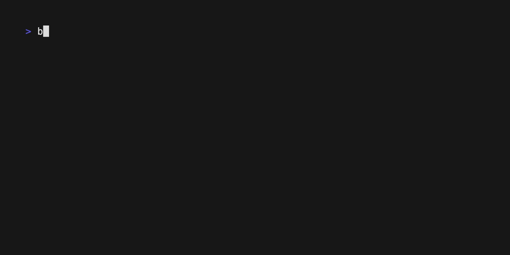

# hedgehog

Connect to a subsonic instance and play a given playlist, optionally shuffling

Features automatic local caching of upcoming tracks

Requires the presence of [mpv](https://mpv.io)

```
make & build/hedgehog --url=https://music.wat --user=sungo --password=wat --playlist "starred" --shuffle
```

## Keybindings

- q / Ctrl-C / Esc : exit
- m : mute toggle
- p / < : Previous
- n / > : Next
- Space : pause toggle
- `*` : star toggle
- r : update playlist from server

## gif



Recorded with [vhs](https://github.com/charmbracelet/vhs)

# Support / Contributing

This is a personal side project and will get about that much attention, maybe
less. If you have patches, feel free to contact me (see https://sungo.io) but I
make no promise as to when or if I'll respond. But, feel free to fork the code,
respecting the license, and have your way with it.

# Licensing

Licensed under 0BSD. See LICENSE.md for details

